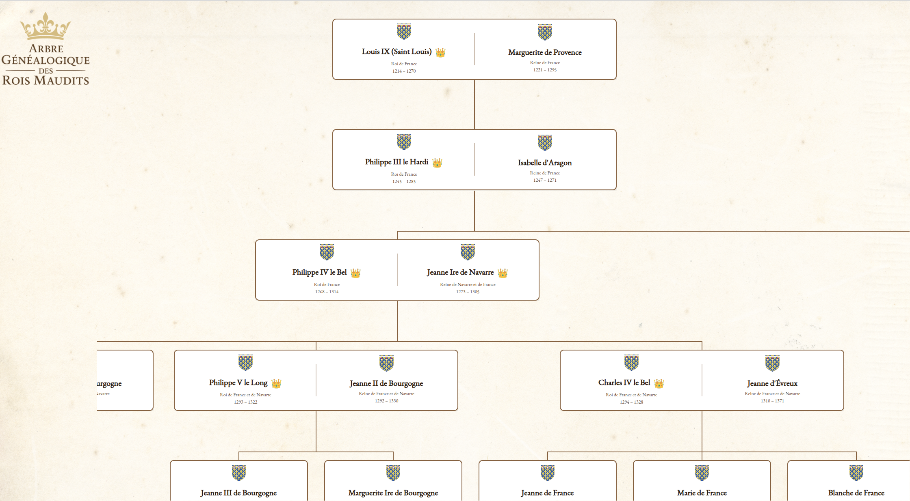

# 🏰 The Accursed Kings / Les Rois Maudits – Interactive Family Tree

This project is an interactive genealogical tree of the Capetian dynasty, inspired by The Accursed Kings (Les Rois Maudits) historical novels.

Built with HTML, CSS, and D3.js, it allows users to explore the lineage of French kings with:

- Visualized parent–child and marriage relationships
- Royal crests (blazons)
- Titles, birth/death dates, and additional info

Data is structured in JSON and rendered dynamically as a vertical tree.

In order to launch the project locally, you can use a simple server like `python3 -m http.server 8080`

## Early WIP Preview:

